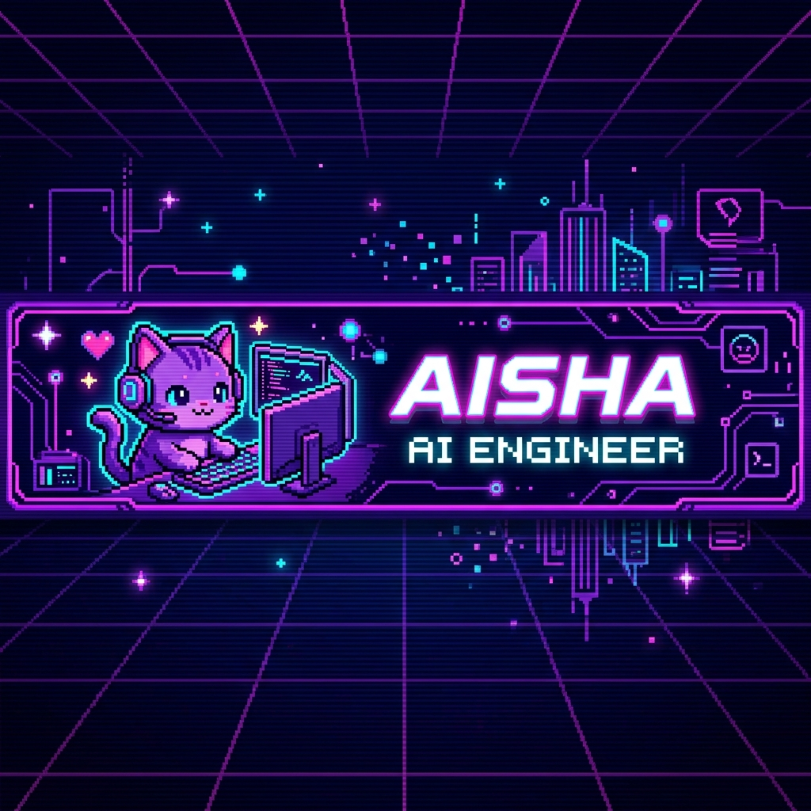

<!-- ============================================================
     AISHA SIDDIQA — GitHub Profile README
     ============================================================ -->

<!-- ╔══════════════════════════════════════════════════════════╗
     ║                        BANNER                            ║
     ╚══════════════════════════════════════════════════════════╝ -->

<div align="center">
  
</div>

<div align="center">
  
</div>

<br/>

<div align="center">

<a href="https://www.linkedin.com/in/aisha-siddiqa-681931251/">
  
</a>
&nbsp;
<a href="mailto:aishasiddiqa243@gmail.com">
  
</a>
&nbsp;
<a href="https://github.com/AishaSid">
  
</a>

</div>

<br/>

<!-- ╔══════════════════════════════════════════════════════════╗
     ║                      ABOUT ME                            ║
     ╚══════════════════════════════════════════════════════════╝ -->

<div align="center">
  <h2>ABOUT ME</h2>
  
</div>

<br/>

<table>
<tr>
<td width="60%" valign="top">

### 🤖 Core Protocol
> **I build cognitive architectures where LLMs don't just chat — they retrieve, reason, coordinate, and act.**

* **Retrieval-Augmented Generation (RAG)**: Advanced pipelines, Reciprocal Rank Fusion, metadata filtering, and semantic search.
* **Agentic AI & Multi-Agent Workflows**: State machine architectures, human-in-the-loop triggers, and automated tool utilization.
* **Production Engineering**: FastAPI services, vector databases, next-gen frontends, and reliable evaluation layers.

```
⚡ status: online & executing task loops...
```

</td>
<td width="40%" valign="top">

<div align="center">
  
</div>

```yaml
# CHARACTER_STATS
ROLE:  "AI Engineer"
HP:    "[██████████] 100%"
AI:    "[██████████] 100%"
RAG:   "[██████████] 100%"
XP:    "Level MAX (+9999)"
STATUS: "Hiring Ready"
```

</td>
</tr>
</table>

<br/>

<div align="center">


</div>

<br/>

<!-- ╔══════════════════════════════════════════════════════════╗
     ║                   FEATURED PROJECTS                      ║
     ╚══════════════════════════════════════════════════════════╝ -->

<div align="center">
  <h2>FEATURED PROJECTS</h2>
  
</div>

<table>
<tr>
<td width="50%" valign="top">

**CoWriteIA**
<br/><sub>AI Collaborative Writing Platform &nbsp;·&nbsp; Final Year Project</sub>

<br/>

Full-stack AI writing platform where an LLM doesn't just autocomplete — it indexes a project, extracts characters, locations and themes, and answers questions about the story via semantic RAG. [...]

<br/>


<br/><br/>

[MJAsrar/cwrite](https://github.com/MJAsrar/cwrite) &nbsp;·&nbsp; [Live Demo](https://cwrite-rho.vercel.app)

</td>
<td width="50%" valign="top">

**Agentic-RAG Resume Screener**
<br/><sub>Fusion RAG-Powered Intelligent HR Chatbot</sub>

<br/>

Resume screening chatbot that routes queries across multiple retrieval strategies — dense semantic search, BM25 keyword matching, and hybrid Reciprocal Rank Fusion — to surface best-matching [...]

<br/>


<br/><br/>

[AishaSid/Agentic-RAG-Resume-Screener](https://github.com/AishaSid/Agentic-RAG-Resume-Screener)

</td>
</tr>
<tr>
<td width="50%" valign="top">

**AI Animated Video Generation**
<br/><sub>Autonomous Multi-Agent Text-to-Film Pipeline &nbsp;·&nbsp; Contributor</sub>

<br/>

Agentic system that turns a single prompt into a complete short film. I built Phases 2 & 3: 15+ neural character voices via Edge-TTS, Freesound BGM with LLM mood analysis, FFmpeg pro audio mixing[...]

<br/>


<br/><br/>

[S-Amna-Amir/AI-Animated-Video-Gen](https://github.com/S-Amna-Amir/AI-Animated-Video-Gen) &nbsp;·&nbsp; Phases 2 & 3 ✅

</td>
<td width="50%" valign="top">

**RAG in the Wild — A Case Study**
<br/><sub>Comparative RAG Pipeline Research & Interactive Demo</sub>

<br/>

Research project implementing and benchmarking 7 RAG strategies on the CRAG dataset: RAG Fusion, HyDE, Corrective RAG, Graph RAG, Multi-Query RAG, RRR, and Basic RAG. Evaluated via RAGAS framewor[...]

<br/>


<br/><br/>

[AishaSid/RAG-in-the-Wild-A-case-study](https://github.com/AishaSid/RAG-in-the-Wild-A-case-study)

</td>
</tr>
</table>

<br/>

<!-- ╔══════════════════════════════════════════════════════════╗
     ║                     SIDE QUESTS                          ║
     ╚══════════════════════════════════════════════════════════╝ -->

<div align="center">
  <h2>SIDE QUESTS</h2>
  
</div>

```text
  CURRENTLY  >  Interviewing for AI Engineer / Product Engineer roles
  EXPLORING  >  Evaluation frameworks (RAGAS), agentic RAG, LLM orchestration
  OPEN TO    >  RAG systems, multi-agent projects, automation frameworks
  ASK ME     >  LangGraph, RAG architecture, vector DBs, full-stack AI apps
  CONTACT    >  aishasiddiqa243@gmail.com
```

<br/>

<!-- ╔══════════════════════════════════════════════════════════╗
     ║                     TECH STACK                           ║
     ╚══════════════════════════════════════════════════════════╝ -->

<div align="center">
  <h2>INVENTORY & TECH STACK</h2>
  
</div>

<!-- Row 1: AI / Agents / RAG + core ML -->


<br/>

<!-- Row 2: Web + DB + infra -->


<br/>

<!-- Row 3: AI/ML ecosystem — shields badges for ones not in skillicons -->


</div>

<br/>

<!-- ╔══════════════════════════════════════════════════════════╗
     ║                      STATS LOG                           ║
     ╚══════════════════════════════════════════════════════════╝ -->

<div align="center">
  <h2>STATS & ARCADE GAMES</h2>
  
</div>

🟡 **PAC-MAN** — contributions as gameplay · built with OS concepts (mutexes, threading, and processes)


★ **GALAGA** — contributions as gameplay · built with OOP concepts


<!-- ╔══════════════════════════════════════════════════════════╗
     ║                       FOOTER                             ║
     ╚══════════════════════════════════════════════════════════╝ -->

<div align="center">
  <sub><b>📬 GET IN TOUCH</b> &nbsp;—&nbsp; <a href="mailto:aishasiddiqa243@gmail.com">aishasiddiqa243@gmail.com</a></sub>
</div>
